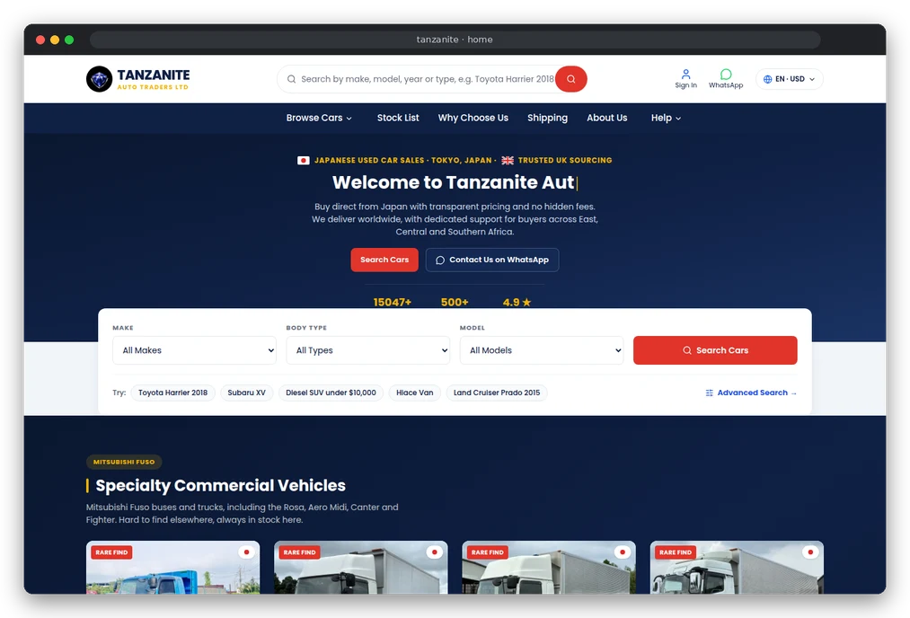
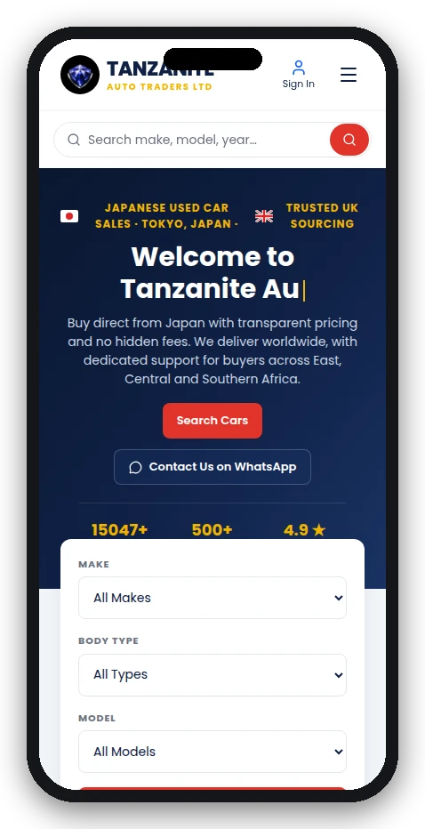
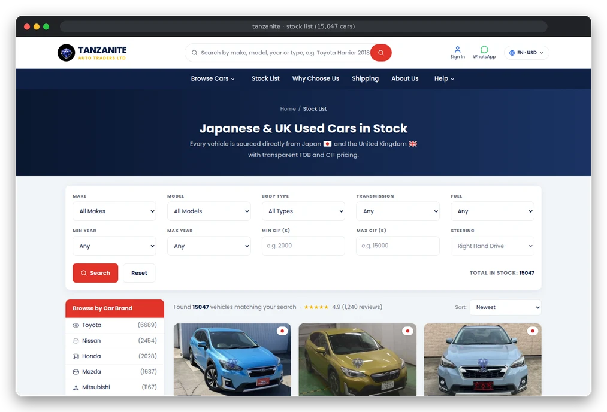
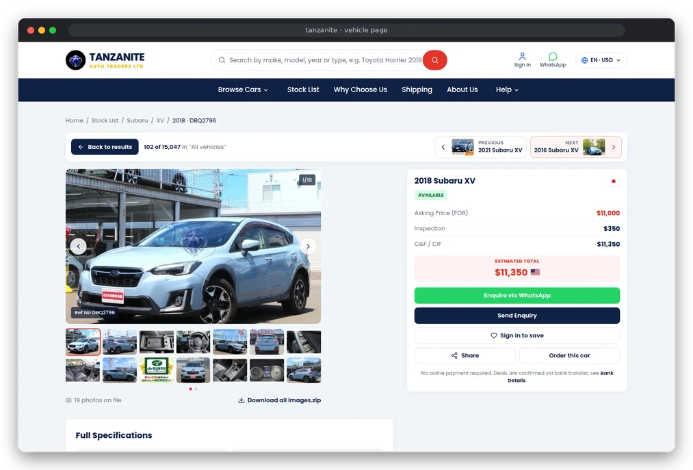
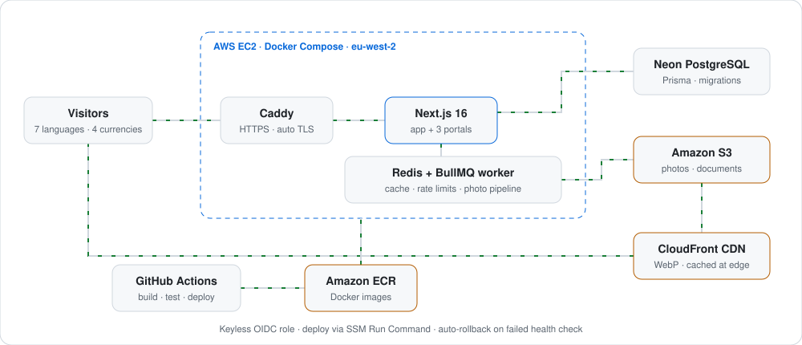
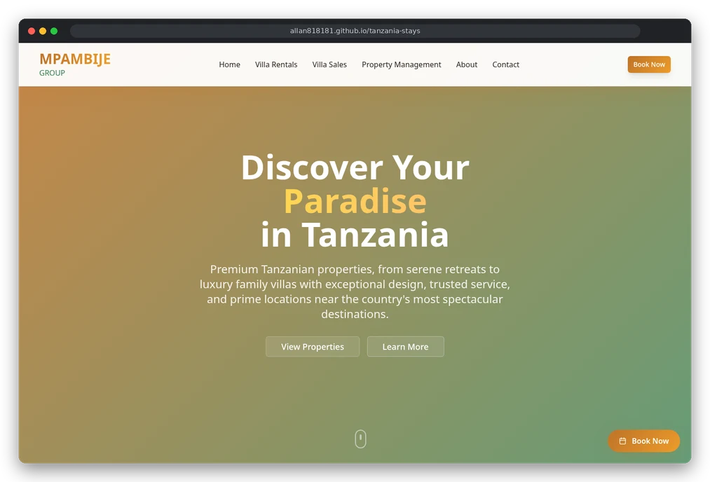

  

  
  
  

## About me

I'm a full-stack engineer who also owns what happens after the code is written: infrastructure, deployments, security and monitoring.

- 🚗 **Right now:** I build and run the production platform for **Tanzanite Auto Traders**, a Japanese used car sales company (Tokyo HQ, East Africa office in Dar es Salaam). I designed it, wrote it, and deployed it to AWS with automated, keyless CI/CD.
- 🧱 **How I work:** typed code, small reviewed commits, infrastructure as scripts, nothing manual that a pipeline can do.
- 📱 **Stack:** web (Next.js, React), mobile (React Native, Flutter), backend (Node.js, Django), cloud (AWS, Docker, GitHub Actions).
- 🌍 **Based in** Dar es Salaam (EAT, UTC+3). I work in English and Swahili.

<picture>
  <source media="(prefers-color-scheme: dark)" srcset="assets/dashboard-dark.svg"/>
  
</picture>

## ⭐ Flagship: Tanzanite Auto Traders (production)

A multilingual car sales platform with a public storefront and three portals (customer, staff, admin), serving **15,000+ vehicles** and **313,000+ photos**. The code is private (client work); here is how it is built and run.

<table>
  <tr>
    <td width="74%"></td>
    <td width="26%" align="center"></td>
  </tr>
</table>
<table>
  <tr>
    <td width="50%">
<b>Stock list</b> · filters, brand counts, infinite scroll
</td>
    <td width="50%">
<b>Vehicle page</b> · 19-photo gallery, live price breakdown, WhatsApp enquiry
</td>
  </tr>
</table>

### How it is built

<picture>
  <source media="(prefers-color-scheme: dark)" srcset="assets/architecture-dark.svg"/>
  
</picture>

| | What I built |
|---|---|
| **Product** | Storefront with smart search, filters and infinite scroll; customer accounts with orders and documents; staff portal with a photo pipeline (ZIP upload, WebP variants, watermarking); admin portal with reports, analytics, content editing and SEO controls |
| **Delivery** | GitHub Actions builds a Docker image, pushes it to ECR and deploys through SSM; database migrations run automatically; a failed health check rolls back to the previous version |
| **Security** | Short-lived OIDC credentials (no long-lived AWS keys), least-privilege IAM, no open SSH port (SSM only), HSTS/CSP headers, rate limiting, role-based access |
| **Operations** | Daily EBS snapshots, budget and SNS alerts, health checks, query monitoring, and cost tuning (e.g. cutting database egress by loading only what each page shows) |

  
  
  
  
  
  
  
  

## 🧰 Tech stack

| | |
|---|---|
| **Languages** |  |
| **Frontend & mobile** |   |
| **Backend & data** |  |
| **DevOps & cloud** |  |

## 🚀 Featured projects

  <b>Live demos:</b>&nbsp;
  
  
  

| Project | What it is | Stack |
|---|---|---|
| [**Tanzania Stays**](https://github.com/allan818181/tanzania-stays) · [live](https://allan818181.github.io/tanzania-stays/) | Villa rentals and sales site with availability calendars and a blog | React · TypeScript · Vite |
| [**Meditrack**](https://github.com/allan818181/hospital-system) | Hospital system with five role-based portals: reception, doctor, lab, pharmacy, admin | Django · DRF |
| [**Vegas Hotel AI Concierge**](https://github.com/allan818181/vegas) | AI chat concierge grounded in a real hotel's suites and prices; captures bookings as leads | Node.js · Express · Gemini |
| [**Dar es Salaam Data Portal**](https://github.com/allan818181/dar-data-portal) | Open-data portal: datasets, a pandas/Matplotlib transform engine, REST API, PDF/Excel reports | Django · DRF · pandas |
| [**LBLS Library System**](https://github.com/allan818181/desktop-library-management-system) | Desktop library system: loans, fines, analytics, audit log, report builder | Python · Tkinter · PostgreSQL |
| [**Abode Harmony**](https://github.com/allan818181/property-management-system) | Landlord and tenant property management with receipts and maintenance requests | React · TypeScript · Supabase |
| [**Inventory System**](https://github.com/allan818181/inventory-frontend) | Full-stack inventory: JWT [REST API](https://github.com/allan818181/inventory-system-backend) + React dashboard | Django REST · React · TS |
| [**Salon Website**](https://github.com/allan818181/salon-web) | Bilingual (EN/SW) site, containerized for production | Django · Tailwind · Docker |
| [**CertifyWell**](https://github.com/allan818181/exam-portal) | Online exam portal with token-protected exams and grading | PHP · MySQL · JavaScript |

 <b>Tanzania Stays</b> · live on GitHub Pages, deployed by a GitHub Actions workflow

## 📈 Activity

<picture>
  <source media="(prefers-color-scheme: dark)" srcset="https://raw.githubusercontent.com/allan818181/allan818181/output/snake-dark.svg"/>
  
</picture>

The dashboard and the snake above are rebuilt every day by a GitHub Actions workflow in this repository (<code>scripts/dashboard.mjs</code>).

